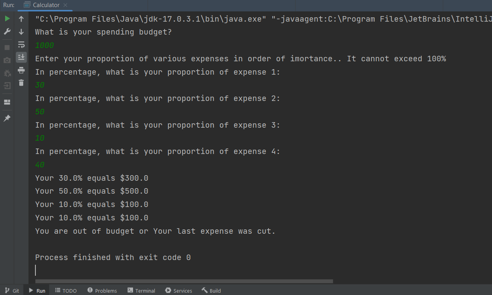

# BudgetAllocatingTask

### Description
A simple java program that helps you manage your spending budget by splitting your budget by percentage until your reach or go over 100%.

### Walkthrough

### Technologies
- Java
- Intellij IDEA
